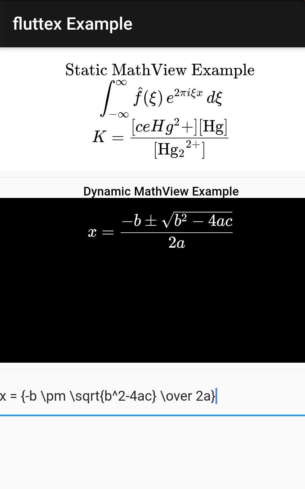

<p align="center">
  <a href="https://github.com/LeonStaufer/fluttex">
    
  </a>

  <p align="center">
    Customizable Flutter plugin that renders TeX equations blazingly fast!
    <br />
    <br />
    <a href='https://pub.dev/packages/fluttex'></a>
    <a href="https://github.com/LeonStaufer/fluttex/issues/new"></a>
    <a href="https://github.com/LeonStaufer/fluttex"></a>
    <br />
  </p>
</p>

## Table of Contents

* [About](#about)
  * [Built With](#built-with)
* [Getting Started](#getting-started)
  * [Installation](#installation)
  * [Usage](#usage)
* [Configuration](#configuration)
* [Roadmap](#roadmap)
* [Contributing](#contributing)
* [License](#license)
* [Contact](#contact)


## About



**Fluttex** is a customizable Flutter plugin that renders TeX equations blazingly fast.


### Built With

This project provides an efficient Widget that renders TeX equations using [KaTeX][katex]. Fluttex is built on [TeX Tools][textools], a TeX library for Android that uses WebViews as a wrapper for KaTeX. As such, it would not have been possible without the great work put into the KaTeX typesetting library for the web. 

## Getting Started

### Installation

1. Add this to your package's `pubspec.yaml` file:    
   ```yaml
   dependencies:
     fluttex: ^0.0.1
   ```
2. You can install packages from the command line with:
   ```shell script
   flutter pub get
   ```
3. Now in your Dart code, you can import it:
    ```dart
    import 'package:fluttex/fluttex.dart';
   ```

### Usage

Add the widget `MathViewStatic` to your build method. Take a look at the [configuration section](#configuration) to see which parameters you can pass.
```dart
var MathView = new MathViewStatic(
    tex: "\\int_{-\\infty}^\\infty \\hat f(\\xi)\\,e^{2 \\pi i \\xi x} \\,d\\xi \\\\",
);
```

The above is an example of a `MathView` that only has the `tex` parameter. Make note that all backslashes have to be escaped.

It is also possible to change the TeX parameter programmatically later on. Create a `MathViewStatic` as usual and add the `onMathViewCreated` callback.
```dart
var MathView = new MathViewStatic(
    onMathViewCreated: (controller) {
        _mathViewController = controller;
    },
);
```

Later on, you can use the `MathViewController` to render new TeX strings.
```dart
_mathViewController.render("\\ce{\$K = \\frac{[\ce{Hg^2+}][\\ce{Hg}]}{[\\ce{Hg2^2+}]}\$}");
```

For more detailed overview of the example, please refer to the [example directory](https://github.com/LeonStaufer/fluttex/tree/master/example).


## Configuration

#### MathView

You can change the following properties of the MathView.

| Key            | Description                                                  | Type                                              | Default |
| -------------- | ------------------------------------------------------------ | ------- | ------- |
| `tex`  | A string of TeX that should be rendered | `String` | `null` |
| `displayMode`  | "If `true` the math will be rendered in display mode, which will put the math in display style (so `\int` and `\sum` are large, for example), and will center the math on the page on its own line. If `false` the math will be rendered in inline mode." | `boolean` | `false` |
| `leqno`        | "If `true`, display math has `\tag`s rendered on the left instead of the right, like `\usepackage[leqno]{amsmath}` in LaTeX." | `boolean` | `false` |
| `fleqno`       | "If `true`, display math renders flush left, like `\documentclass[fleqn]` in LaTeX." | `boolean` | `false` |
| `throwOnError` | "If `true` (the default), KaTeX will throw a `ParseError` when it encounters an unsupported command or invalid LaTeX. If `false`, KaTeX will render unsupported commands as text, and render invalid  LaTeX as its source code with hover text giving the error, in the color  given by `errorColor`." | `boolean` | `false` |
| `color`        | The color of the TeX rendered in the MathView. | `Color` | `black` |
| `colorBackground` | The background color of the MathView. | `Color` | `white` |
| `colorError`   | A color that determines the color that unsupported commands and invalid LaTeX are rendered in when `throwOnError` is set to `false`. | `Color` | `#c00`  |
| `fontSize`   | The font size of the rendered TeX string. | `Integer` | `16`  |

> Descriptions are partially quoted from the [KaTeX Docs][katex-docs].


<!-- ROADMAP -->

## Roadmap

Here's a list of additions that are planned for the future:

1. Support for iOS
2. Support for Flutter Web
3. Interactive MathView
4. MathInput, that checks the TeX input for correctness and offers typing support

See the [open issues][issues] for a list of proposed features (and known issues).


<!-- CONTRIBUTING -->
## Contributing

Contributions are what make the open source community such an amazing place to be learn, inspire, and create. Any contributions you make are **greatly appreciated**.

1. Fork the Project
2. Create your Feature Branch (`git checkout -b feature/AmazingFeature`)
3. Commit your Changes (`git commit -m 'Add some AmazingFeature'`)
4. Push to the Branch (`git push origin feature/AmazingFeature`)
5. Open a Pull Request


<!-- LICENSE -->
## License

Distributed under the BSD 3-Clause License. See `LICENSE` for more information.


<!-- CONTACT -->
## Contact

If you have any questions, feel free to contact [Leon Staufer][email].

Project Link: [https://github.com/LeonStaufer/fluttex][project]

## Disclaimer

> This plugin has been developed independently from and is not endorsed by Google. Flutter, and the Flutter logo are registered trademarks owned by the Google.


<!-- MARKDOWN LINKS & IMAGES -->
[product-screenshot]: assets/screenshot.jpg
[project]: https://github.com/LeonStaufer/fluttex
[issues]: https://github.com/LeonStaufer/fluttex/issues
[email]: mailto:leon@staufer.me
[katex]: https://katex.org/
[katex-docs]: https://katex.org/docs/options.html
[textools]: https://github.com/LeonStaufer/TeXTools
